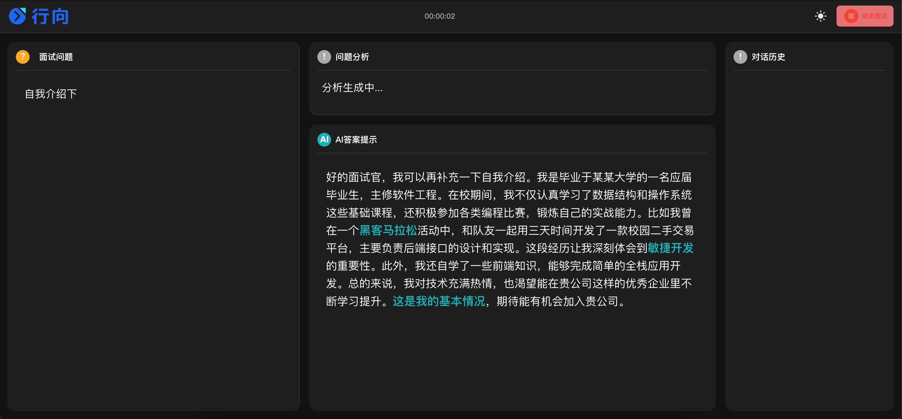
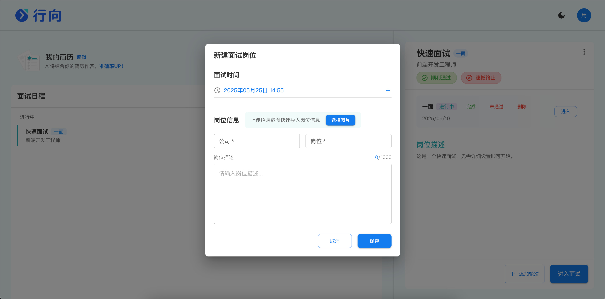
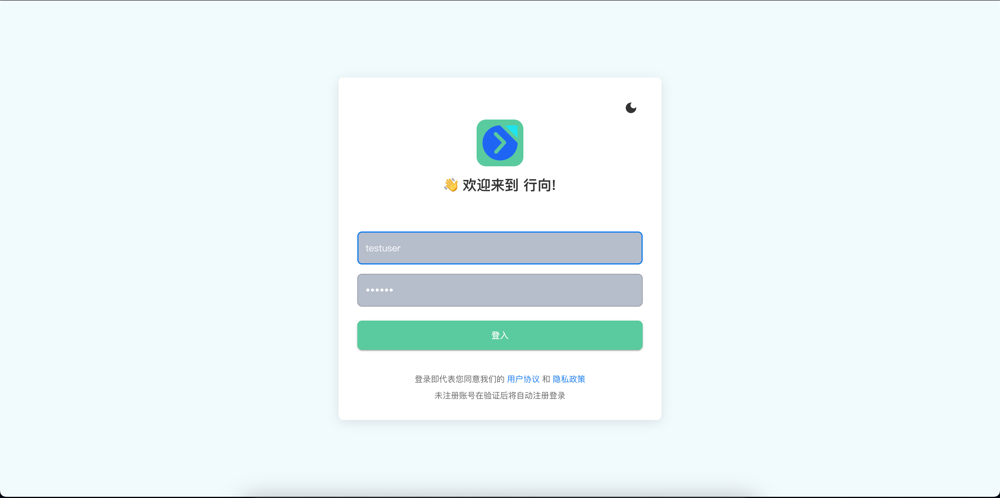
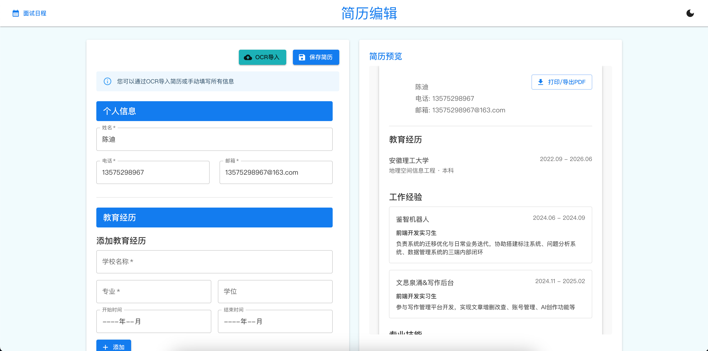
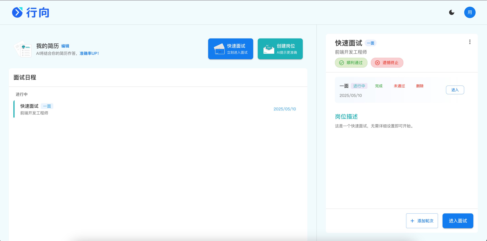
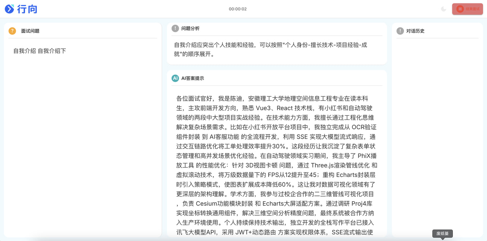

# 行向项目简介

个人使用cursor开发的练手项目，项目为AI面试系统，通过共享系统声音，调用语音识别服务，静音检测1s自动发送AI回答，实现面试流程的自动化。

## 前后端说明

- **interview-next（前端）**：
  - Next.js + TypeScript + Zustand + Material-UI 
- **interview-springboot（后端）**：
  - Spring Boot + MyBatis + MySQL + JWT 
- **第三方服务**：
  - 科大讯飞实时语音
  - 阿里云百炼：通义千问 `流式请求用于AI面试，非流式用于替代OCR+简单问题`
  - 阿里云OSS

## 目录结构

- `图片/`：包含所有核心界面设计图，用于演示产品功能和交互流程。
- `interview-next/`：前端项目
- `interview-springboot/`：后端项目
- `后端接口+数据库`：包含5个表结构，18个接口的设计文档。

## 项目展示

- **模式切换**
  
  
  
  展示应用在不同模式（如查看、编辑、管理等）下的界面切换效果。

- **添加面试**
  
  
  
  展示添加新面试日程或记录的操作界面。

- **登入界面**
  
  
  
  用户登录系统的入口界面。

- **简历编辑**
  
  
  
  用于编辑和完善个人简历的详细界面。

- **面试日程**
  
  
  
  集中展示所有面试安排和日程，便于用户一览无余。

- **面试界面**
  
  
  
  面试进行时的操作区和信息展示区。

## 使用场景

1. 用户通过“登入界面”登录系统。
2. 进入“面试日程”查看所有安排，可通过“添加面试”界面新增日程。
3. 在“简历编辑”界面完善个人简历。
4. 进入“面试界面”共享屏幕，拿到面试官声音，AI回答问题。

## 项目收获

- 如何AI设计一款产品 `AI用svg生成设计稿，减少token`
- 如何和AI 一起编写代码
  1. 打印日志,帮助AI调试
  2. 反问它的理解、双向费曼
  3. 区分最小单元代码和最小逻辑代码块，逻辑要自己梳理
  4. AI给思路，我来填充 （盲目的话，上限很低）
  5. 我给思路，AI来补充  （最佳选择）
  6. 提出一个好的问题，也很重要
- Prompt 提示词
- Next
- 前后端整体设计